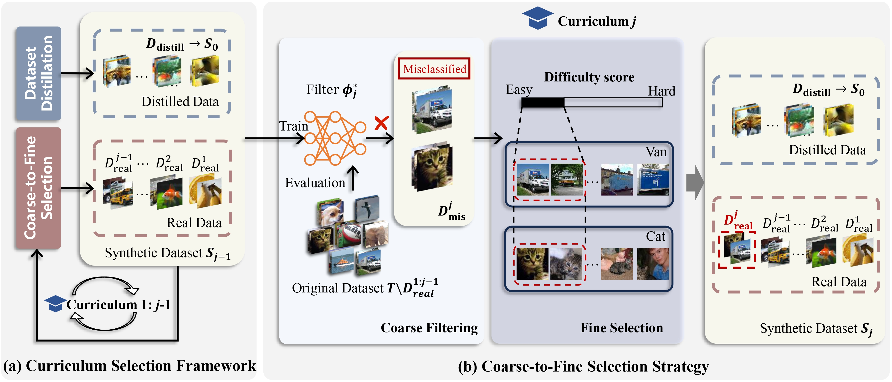
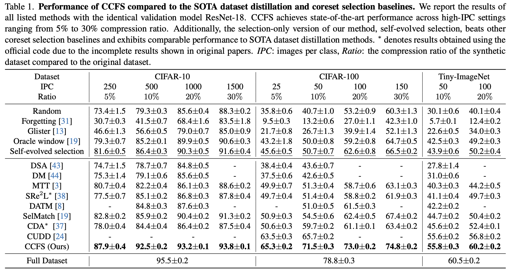

# Curriculum Coarse-to-Fine Selection for High-IPC Dataset Distillation

Yanda Chen, Gongwei Chen, [Miao Zhang](https://miaozhang0525.github.io/), Weili Guan, [Liqiang Nie](https://liqiangnie.github.io/)

[`arXiv`](https://arxiv.org/abs/2503.18872) | [`BibTeX`](#bibliography)

<div align="center">
    
</div>

Official PyTorch implementation of the paper **Curriculum Coarse-to-Fine Selection for High-IPC Dataset Distillation (CVPR 2025)**. This repo contains code for conducting CCFS on CIFAR-10/100 and Tiny-ImageNet based on the already distilled data.

## Abstract
Dataset distillation (DD) excels in synthesizing a small number of images per class (IPC) but struggles to maintain its effectiveness in high-IPC settings.
Recent works on dataset distillation demonstrate that combining distilled and real data can mitigate the effectiveness decay. 
However, our analysis of the combination paradigm reveals that the current one-shot and independent selection mechanism induces an incompatibility issue between distilled and real images. 
To address this issue, we introduce a novel curriculum coarse-to-fine selection (CCFS) method for efficient high-IPC dataset distillation.
CCFS employs a curriculum selection framework for real data selection, where we leverage a coarse-to-fine strategy  to select appropriate real data based on the current synthetic dataset in each curriculum.
Extensive experiments validate CCFS, surpassing the state-of-the-art by +6.6\% on CIFAR-10, +5.8\% on CIFAR-100, and +3.4\% on Tiny-ImageNet under high-IPC settings.
Notably, CCFS achieves 60.2\% test accuracy on ResNet-18 with a 20\% compression ratio of Tiny-ImageNet, closely matching full-dataset training with only 0.3\% degradation.

## TODOs

- [ ] Teacher checkpoints and CDA distilled data. 
- [ ] Eval scripts.
- [ ] Citation.
- [ ] Author link.

## Usage

### Requirements

```
pandas==2.2.3
torch==2.2.1
torchvision==0.17.1
tqdm==4.66.2
```
### Preparation

To conduct a single experiment, you need to prepare a teacher checkpoint for relabeling, difficulty scores for corresponding dataset and already distilled data structured in the following format:

```
/path/to/distilled_dataset/
├── 00000/
│   ├── image1.jpg
│   ├── image2.jpg
│   ├── image3.jpg
│   ├── image4.jpg
│   └── image5.jpg
├── 00001/
│   ├── image1.jpg
│   ├── image2.jpg
│   ├── image3.jpg
│   ├── image4.jpg
│   └── image5.jpg
├── 00002/
│   ├── image1.jpg
│   ├── image2.jpg
│   ├── image3.jpg
│   ├── image4.jpg
│   └── image5.jpg
```

The `c-scores` for CIFAR10/100 and the `forgetting scores` for CIFAR10/100 and Tiny-ImageNet are provided in [`scores/`](scores/).

Follow the squeeze instructions in `SRe2L` ([CIFAR](https://github.com/VILA-Lab/SRe2L/blob/main/SRe2L/*small_dataset/README_CIFAR.md) / [Tiny-ImageNet](https://github.com/VILA-Lab/SRe2L/blob/main/SRe2L/*small_dataset/README_TINY.md)) to train the teacher model ResNet-18:

| **Dataset**    | **Backbone**        | **epochs**      | **acc@1(last)**   | **Input Size**   |
| -------------- | ------------------- | --------------- | ----------------- | ---------------- |
| CIFAR10        | ResNet18 (modified) | 200             | 95.53             | 32 $\times$ 32   |
| CIFAR100       | ResNet18 (modified) | 200             | 78.72             | 32 $\times$ 32   |
| Tiny-ImageNet  | ResNet18 (modified) | 200             | 60.50             | 64 $\times$ 64   |

In the main table of our paper, we used distilled data synthesized by [`CDA`](https://github.com/VILA-Lab/SRe2L/tree/main/CDA). 
Note that `CCFS` can be extended to most dataset distillation methods, as long as you have the distilled data and organize it into the image folder structure.
We encourage adopting different distilled data by other DD methods and configuring corresponding data augmentation and training settings to verify the scalability of `CCFS`.

### How to Run
For the 3 small datasets (CIFAR-10/100, Tiny-ImageNet), we provide single GPU implementation of `CCFS`. Run the following command to conduct CCFS on Tiny-ImageNet with IPC = 50:

```shell
CUDA_VISIBLE_DEVICES=0, python ccfs_tiny.py \
    --data-path /path/to/Tiny-ImageNet/ --filter-model resnet18 --teacher-model resnet18 \
    --teacher-path ./checkpoints/resnet18_tiny_200epochs.pth  --eval-model resnet18 \
    --device cuda --batch-size 64 --epochs 100 --opt sgd --lr 0.2 --momentum 0.9 --weight-decay 1e-4 \
    --lr-scheduler cosineannealinglr --lr-warmup-epochs 5 --lr-warmup-method linear --lr-warmup-decay 0.01 \
    --distill-data-path ./syn-data/cda_tiny_rn18_4k_ipc100 \
    -T 20 --image-per-class 50 --alpha 0.2 --curriculum-num 3 \
    --select-misclassified --select-method simple --balance \
    --score forgetting --score-path ./scores/forgetting_Tiny.npy \
    --output-dir ./selection_logs --num-eval 5
```
To facilitate experiments running, we provide [`scripts`](scripts/) for running the bulk experiments in the paper:

```shell
sh ./scripts/ccfs_tiny.sh
```

After running, the selected real image indices will be stored as `selected_indices.json`. The experiment configurations will also be saved as `exp_log.txt`.

To quickly validate the performance of the synthetic dataset without the relabel process, we provide validation code with naive KD following [SRe2L](https://github.com/VILA-Lab/SRe2L/blob/main/SRe2L/validate/README.md). Set `--selected_indices_path` to the correct `selected_indices.json` file and run the following command to conduct a quick validation on Tiny-ImageNet with IPC = 50:

```shell
CUDA_VISIBLE_DEVICES=0, python eval_tiny.py \
    --data-path /path/to/Tiny-ImageNet/ --eval-model resnet18 \
    --teacher-model resnet18 --teacher-path ./checkpoints/resnet18_tiny_200epochs.pth \
    --device cuda --batch-size 64 --epochs 100 --opt sgd --lr 0.2 --momentum 0.9 --weight-decay 1e-4 -T 20 \
    --lr-scheduler cosineannealinglr --lr-warmup-epochs 5 --lr-warmup-method linear --lr-warmup-decay 0.01 \
    --distill-data-path ./syn-data/cda_tiny_rn18_4k_ipc100 \
    --selected_indices_path ./selection_logs/Tiny/selected_indices.json \
    --image-per-class 50 --num-eval 5
```

## Results
Performance of CCFS compared to the SOTA dataset distillation and coreset selection baselines.

<div align="center">
    
</div>

## Bibliography

If you find this repository helpful for your project, please consider citing our work:

```
@misc{chen2025curriculumcoarsetofineselectionhighipc,
      title={Curriculum Coarse-to-Fine Selection for High-IPC Dataset Distillation}, 
      author={Yanda Chen and Gongwei Chen and Miao Zhang and Weili Guan and Liqiang Nie},
      year={2025},
      eprint={2503.18872},
      archivePrefix={arXiv},
      primaryClass={cs.CV},
      url={https://arxiv.org/abs/2503.18872}, 
}
```
