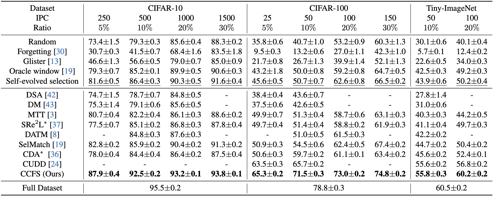

# CCFS
Curriculum Coarse-to-Fine Selection for High-IPC Dataset Distillation

We provide the experimental procedures for CIFAR-10 with IPC=500, CIFAR-100 with IPC=50, and Tiny-ImageNet with IPC=100 in the form of Jupyter Notebook files.

**Architecture of our curriculum coarse-to-fine selection method for high-IPC dataset distillation, CCFS.** CCFS adopts a combination of distilled and real data to construct the final synthetic dataset. We apply a curriculum framework and select the optimal real data for the current synthetic dataset in each curriculum. (a) **Curriculum selection framework**: CCFS begins the curriculum with the already distilled data as the initial synthetic dataset. Then continuously incorporates real data into the current synthetic dataset through the coarse-to-fine selection within each curriculum phase. (b) **Coarse-to-fine selection strategy**: In the coarse stage, CCFS trains a filter model on the current synthetic dataset and evaluates it on the original dataset excluding already selected data to filter out all correctly classified samples. In the fine stage, CCFS selects the simplest misclassified samples and incorporates them into the current synthetic dataset for the next curriculum.

